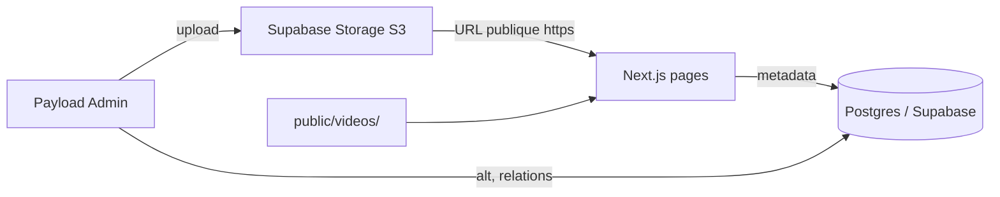

# Référence — Supabase Storage + Payload

## Schéma

## Fichiers clés du repo

| Fichier | Responsabilité |
|---------|----------------|
| `src/payload/storage.ts` | Plugin S3, `generateFileURL`, `clientUploads` |
| `src/collections/Media.ts` | Collection upload + `access.read: () => true` |
| `src/seed/media-lib.ts` | Import depuis `_assets-client/` |
| `src/lib/site-media.ts` | Manifest fallback dev |
| `src/lib/data.ts` | Résolution URLs pour le frontend |

## Bucket Supabase public

Politique recommandée : bucket **public** pour les médias vitrine (photos plateaux, portraits).

Les URLs générées suivent le format :

`https://<ref>.supabase.co/storage/v1/object/public/<bucket>/media/<filename>`

## Revalidation ISR

Pages médias : `export const revalidate = 300` (accueil, galerie, formations, intervenants).

## Sécurité migration production

`MIGRATE_MEDIA_SECRET` protège `POST /api/seed/migrate-storage` (optionnel). Migration prod recommandée : `pnpm migrate:prod`.

## Hero vidéo

Reste dans `public/videos/` (commit Git). Régénération : `pnpm seed:hero`.
